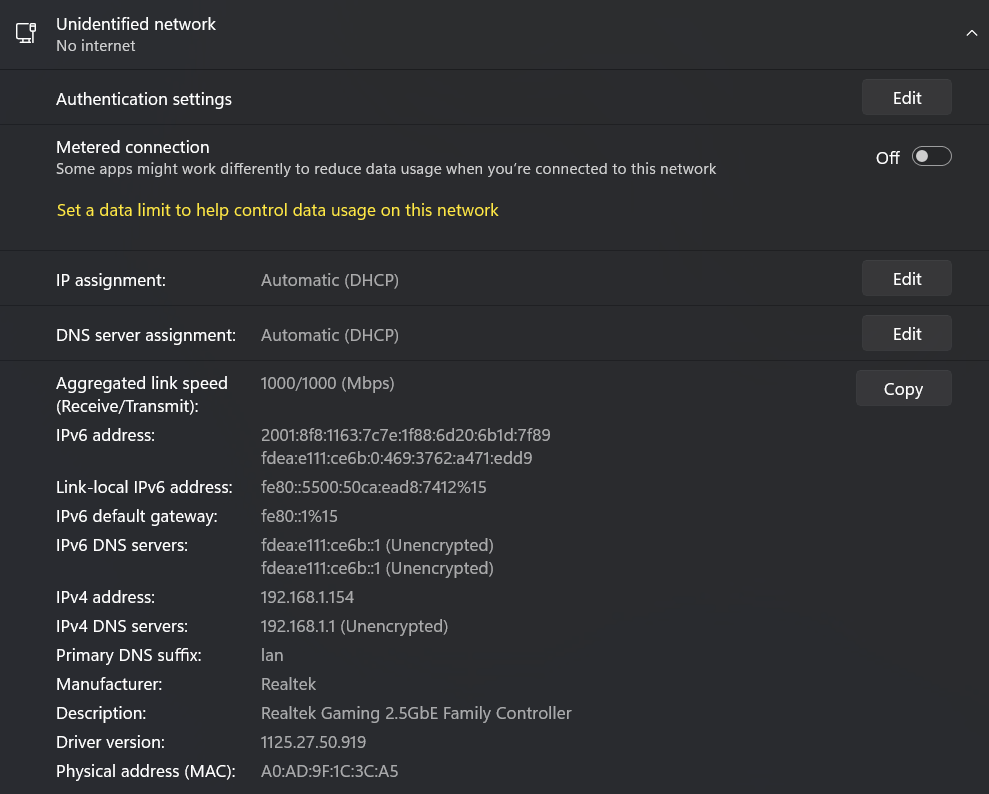
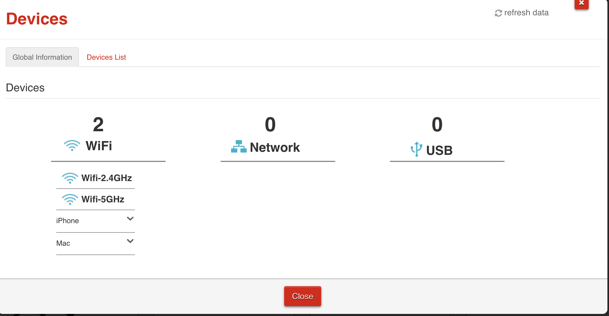
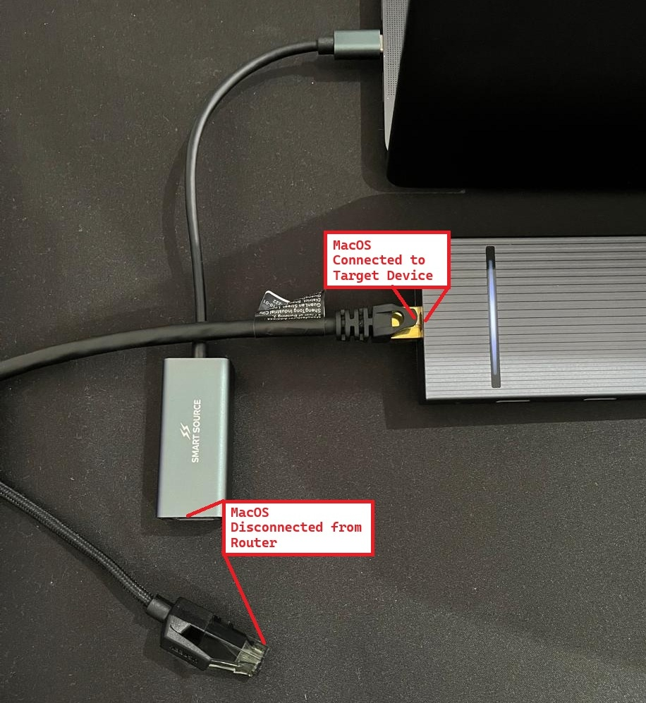
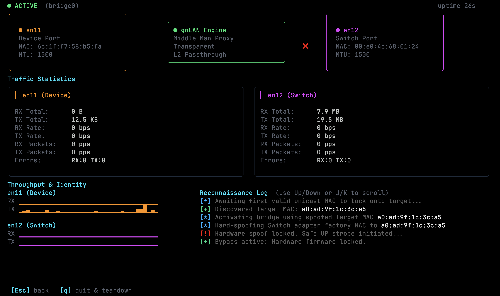
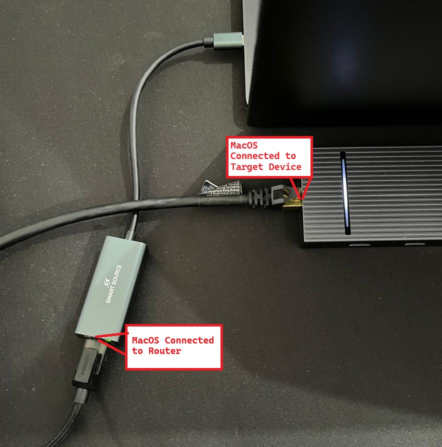
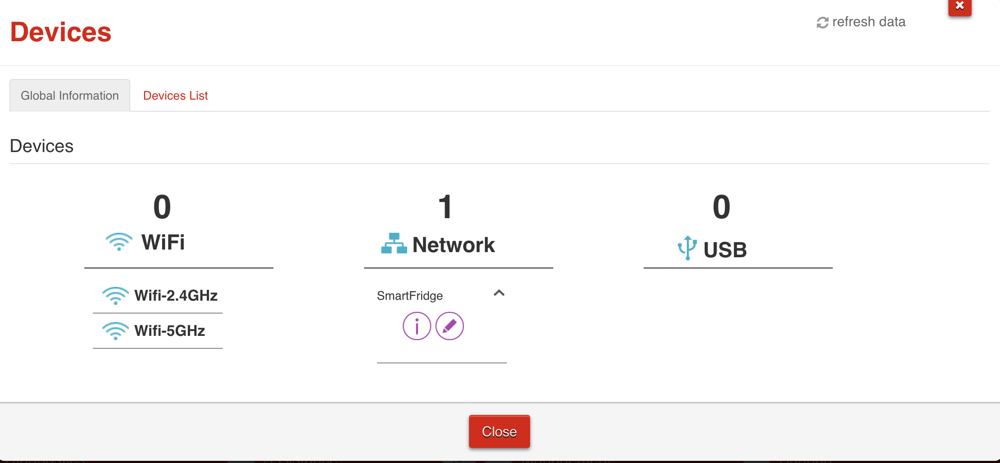
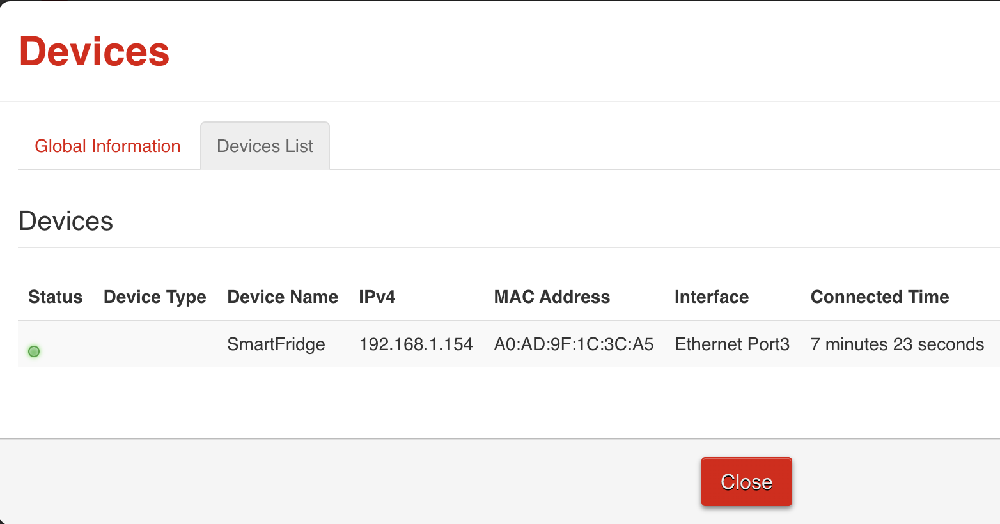

# Guide of non 802.1x Setup

### Network Topology
You require two network interfaces or external adapters. This would ultimately be the flow. 
```sh
Target Device <---RJ45-1---> Router
goLAN <---RJ45-2---> null
# Remove the RJ45-1 from the Target Device
# Connect the RJ45-1 to goLAN with the Ethernet Cable
# Connect the RJ45-2 to the Router, but NOT the Ethernet Cable
# Start the goLAN
Target Device <---RJ45-1---> goLAN
Target Device <---RJ45-1---> goLAN <---RJ45-2---> null
# Wait for goLAN to release the interface
# Connect the Ethernet Cable to RJ45-2
Target Device <---RJ45-1---> goLAN <---RJ45-2---> Router
```

### Target Device

The target device was allowed on the network via MAC address and assigned Static IP.

```ts
MAC: A0:AD:9F:1C:3C:A5
IPv4: 192.168.1.154
```

### Router

After removing the Target Device from the network, the router can no longer find the device, duh. But at this point you should connect the Target Device to the goLAN device with the Ethernet cable. However, the second Ethernet Cable Adapter should be connected to goLAN, but not the physical Ethernet Cable with it. 

### goLAN setup

Choose the two Ethernet Cable Adapters, and ensure it matches the physical layout of the adapters. 

### RJ45 Layout

Example of the current layout of the Ethernet Cables and Adapters.

### goLAN use

After choosing the correct adapters, the goLAN should start bridging the two networks. Where it will attempt to capture ARP packets to emulate the Target Device.

### New RJ45 Layout

After goLAN has completed the steps, its then safe to connect the other Ethernet Cable to the router. This step is important, as soon as you plug in the cable, macOS will immediatly ping the info before the bridge is made, causing your device to report its hostname etc, to the Router. 

### New goLAN UI

Should some info be missing, like getting link local address, the script will wait for the DHCP to assign the IP address, should this not be retrievable from the Target Device beforehand. 

### Router Stats
The router should see the goLAN/macOS as the Target Device, and subsequent network traffic, TCP/UDP will be forwarded onto the bridge from goLAN, spoofing the Target Device.

