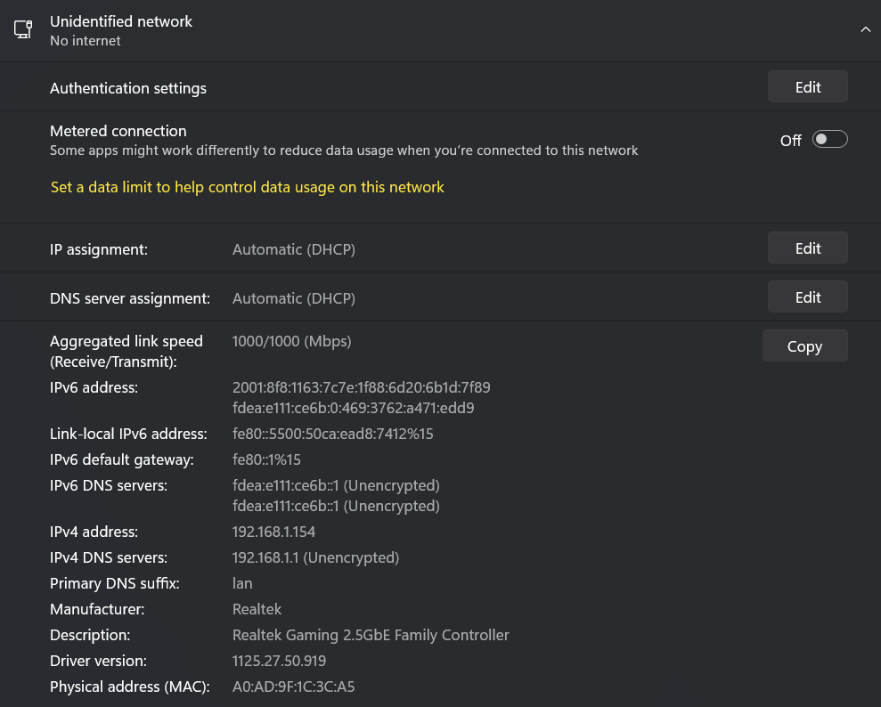
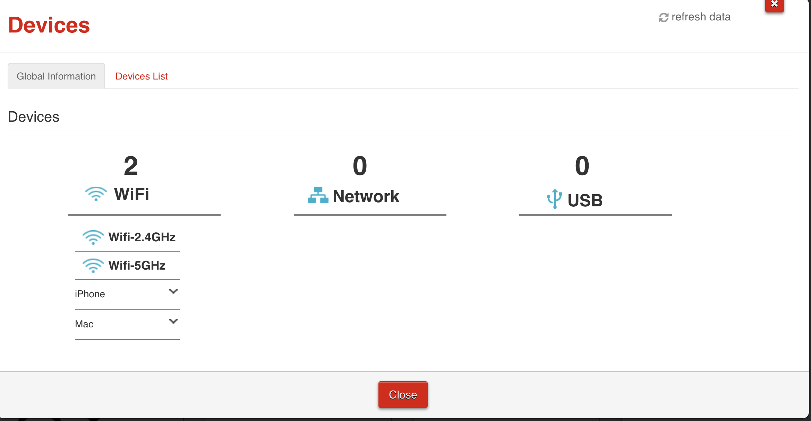
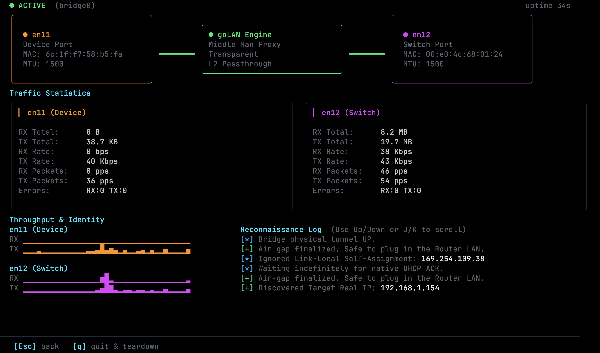
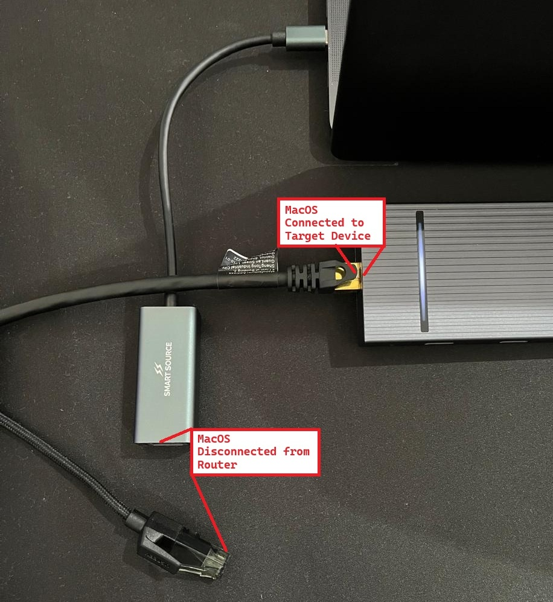
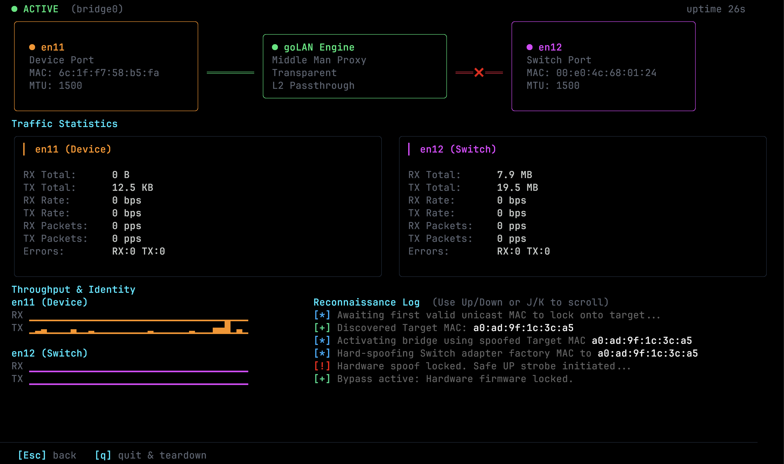
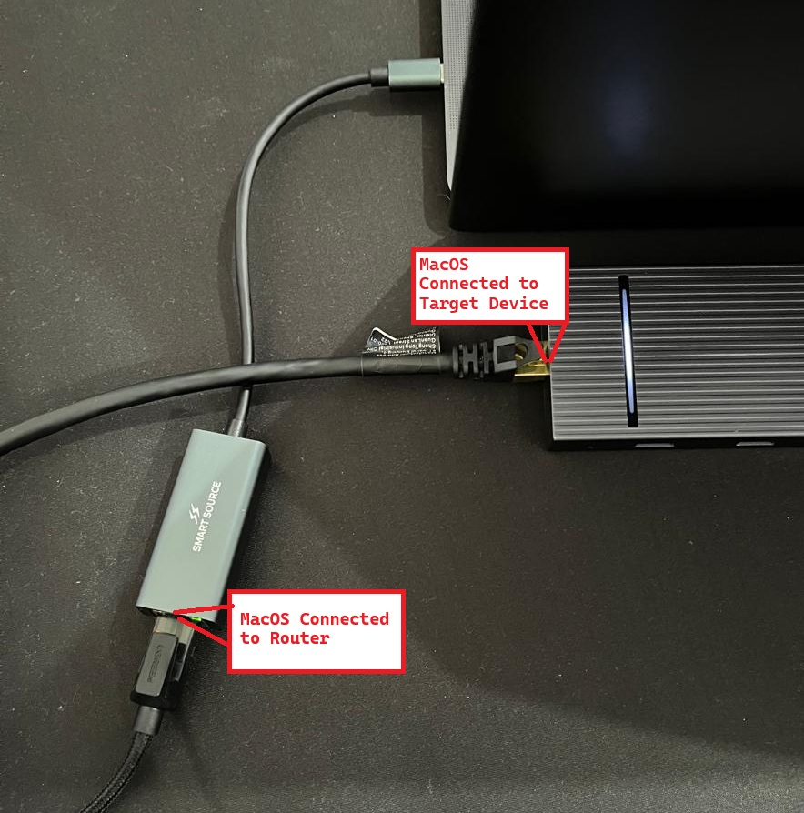
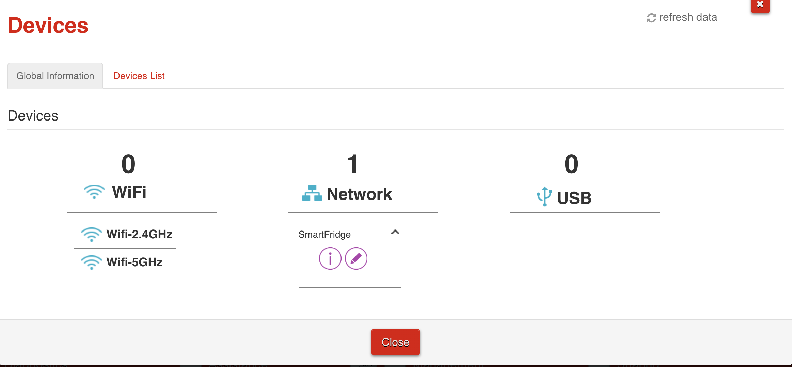
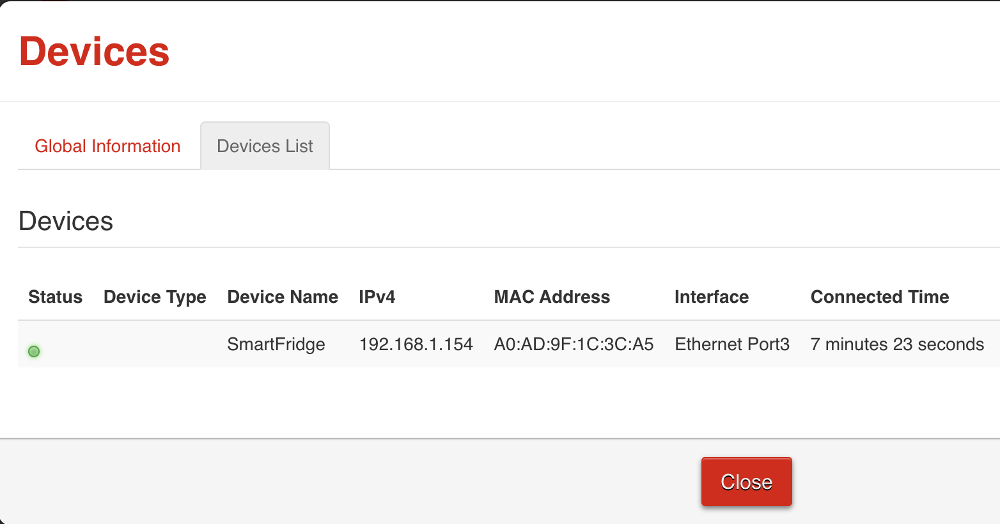

# Guide of non 802.1x Setup

### Network Topology
You require two network interfaces or external adapters. This would ultimately be the flow. 
```sh
Target Device <---RJ45-1---> Router
goLAN <---RJ45-2---> null
# Remove the RJ45-1 from the Target Device
# Connect the RJ45-1 to goLAN with the Ethernet Cable
# Connect the RJ45-2 to the Router, but NOT the Ethernet Cable
# Start the goLAN
Target Device <---RJ45-1---> goLAN
Target Device <---RJ45-1---> goLAN <---RJ45-2---> null
# Wait for goLAN to release the interface
# Connect the Ethernet Cable to RJ45-2
Target Device <---RJ45-1---> goLAN <---RJ45-2---> Router
```

### Target Device

The target device was allowed on the network via MAC address and assigned Static IP.

```ts
MAC: A0:AD:9F:1C:3C:A5
IPv4: 192.168.1.154
```

### Router

After removing the Target Device from the network, the router can no longer find the device, duh. But at this point you should connect the Target Device to the goLAN device with the Ethernet cable. However, the second Ethernet Cable Adapter should be connected to goLAN, but not the physical Ethernet Cable with it. 

### goLAN setup

Choose the two Ethernet Cable Adapters, and ensure it matches the physical layout of the adapters. 

### RJ45 Layout

Example of the current layout of the Ethernet Cables and Adapters.

### goLAN use

After choosing the correct adapters, goLAN starts in passive Layer 2 discovery mode. The Switch Port must have no physical carrier when starting; if it is already linked, goLAN refuses to continue. It keeps the switch-side adapter down, listens on the device-side adapter, and learns the target MAC from printer-originated evidence. It does not request DHCP, assign an IP address, or require an IP/gateway to continue. Once the bridge is active, EAPOL/LLDP/CDP control frames are relayed explicitly so NAC control traffic is not dependent on macOS bridge behavior.

### New RJ45 Layout

After goLAN has completed the steps, its then safe to connect the other Ethernet Cable to the router. This step is important, as soon as you plug in the cable, macOS will immediatly ping the info before the bridge is made, causing your device to report its hostname etc, to the Router. 

### New goLAN UI

Static-IP targets are supported. IP, gateway, subnet, and DHCP data are displayed only if they are observed passively in target traffic; they are not required for bridge activation.

### Router Stats
The router should see traffic sourced from the target device over the transparent Layer 2 bridge. TCP/UDP forwarding is not performed by macOS routing or NAT; Ethernet frames traverse the bridge directly.


