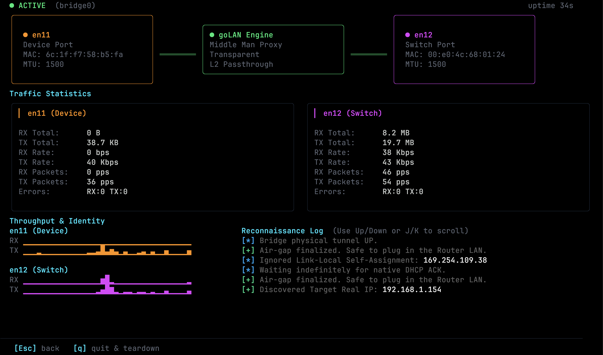

# goLAN

Software Layer 2 network bridge for macOS; virtual female-to-female RJ45 adapter.

> [!IMPORTANT]
> Requires root privileges to run.

Built with Go, [Bubbletea](https://github.com/charmbracelet/bubbletea), and [Lipgloss](https://github.com/charmbracelet/lipgloss).



## Install

```bash
git clone https://github.com/mcrn/goLAN.git
cd goLAN
make install
# or 
go build -o .
```

# Example usage

[Guide of non 802.1x Setup](EXAMPLE.md)

## License

See [LICENSE](LICENSE) for details.
