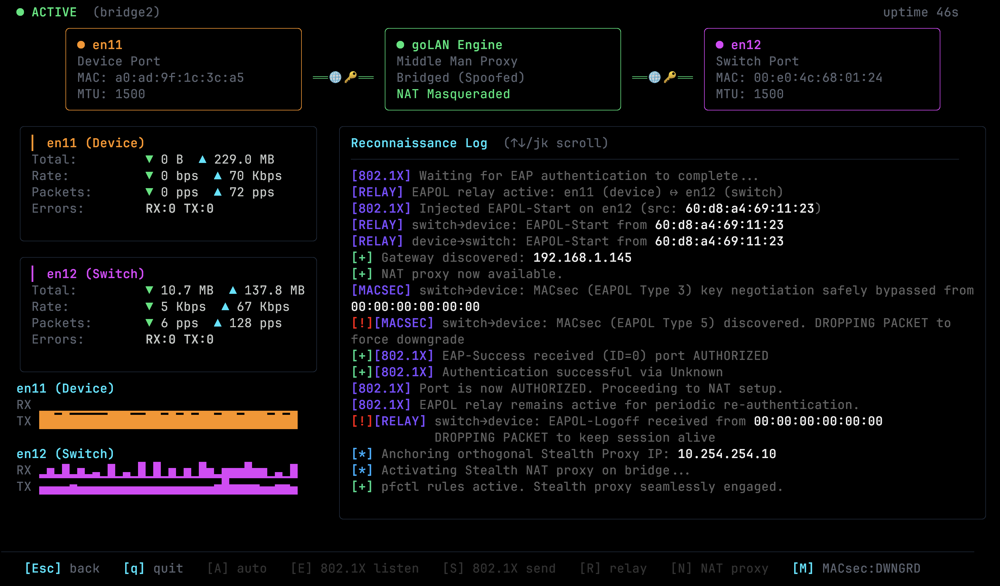

# goLAN

Software Layer 2 network bridge for macOS; virtual female-to-female RJ45 adapter.

# WIP 2 802.1X

> [!IMPORTANT]
> Requires root privileges to run.

Built with Go, [Bubbletea](https://github.com/charmbracelet/bubbletea), and [Lipgloss](https://github.com/charmbracelet/lipgloss).



## Install

```bash
git clone https://github.com/mcrn/goLAN.git
cd goLAN
make install
# or 
go build -o .
```

## Sessions

goLAN writes each session under `~/.config/goLAN/sessions/<session-id>/` with the session JSON and pcaps together. On exit it prints the session ID. Resume or append to it with:

```bash
sudo golan <session-id>
```

`--session <path-or-id>` is also supported for explicit paths or IDs. `--nuke` purges goLAN sessions and pcaps from the config directory.

# Example usage

[Guide of non 802.1x Setup](EXAMPLE.md)

[802.1X Scenario Walkthrough](SCENARIOS.md)

[Layer 2-first NAC Flow](NAC_FLOW.md)

## License

See [LICENSE](LICENSE) for details.
